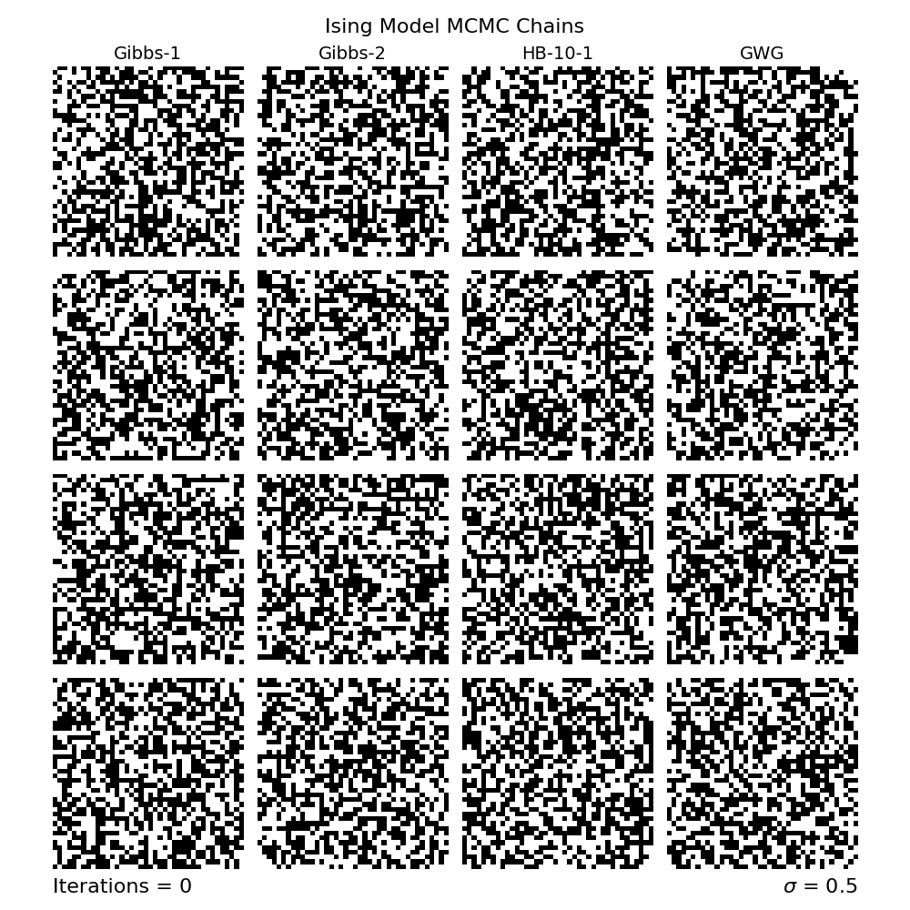
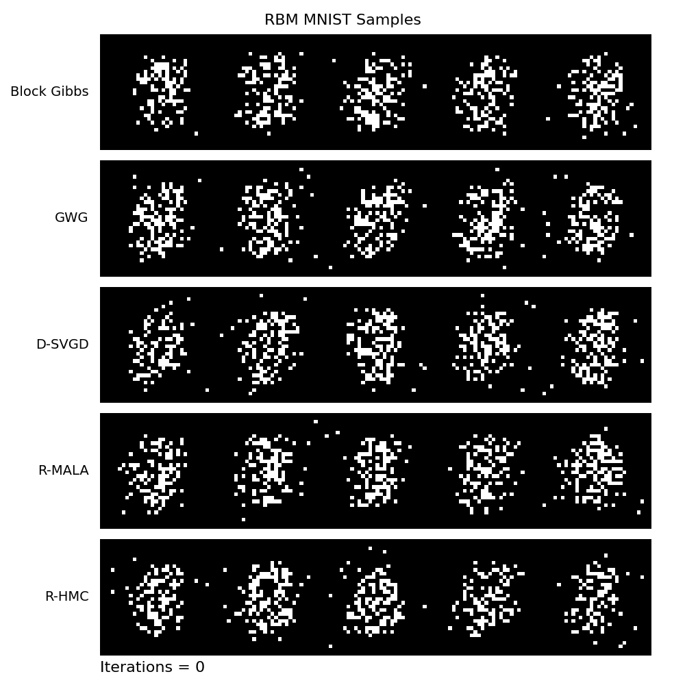

# 6.7830 Project: Exploring the Scalability of MCMC Methods for Discrete Distributions

This repository contains code for reproducing the main results of the paper ["Oops I Took A Gradient: Scalable Sampling for Discrete Distributions"](https://proceedings.mlr.press/v139/grathwohl21a.html) by Grathwohl et al. (2021), adapted from https://github.com/wgrathwohl/GWG_release. The paper proposes **Gibbs-With-Gradients (GWG)**, an efficient MCMC algorithm that incorporates gradient information to improve sampling for discrete distributions.

I evaluate GWG on three discrete probabilistic models:  
- **Ising Model**
- **Restricted Boltzmann Machine (RBM)**
- **Factorial Hidden Markov Model (FHMM)**

## Reproducing Results

0. **Setup Environment**

   - Create and activate a new conda environment.
      ```
      conda create -n gwg python=3.11
      conda activate gwg
      ```
   - Install dependencies.
      ```
      pip install -r requirements.txt
      ```

1. **Run Experiments** (generates `.pkl` files under `save/`)
   - [`ising.ipynb`](ising.ipynb) — Ising model experiments
   - [`rbm.ipynb`](rbm.ipynb) — RBM experiments with Gibbs-like samplers
   - [`rbm_relax.ipynb`](rbm_relax.ipynb) — RBM experiments with continuous relaxations (R-HMC, R-MALA, D-SVGD)
   - [`fhmm.ipynb`](fhmm.ipynb) — FHMM experiments

2. **Plot Figures** (numbering matching the GWG paper, reads from `save/` directory)
   - [`figure_2.ipynb`](figure_2.ipynb)
   - [`figure_3.ipynb`](figure_3.ipynb)
   - [`figure_4.ipynb`](figure_4.ipynb)
   - [`figure_5.ipynb`](figure_5.ipynb)

Note that full `.pkl` files necessary for creating the Ising model animations were too large to upload to GitHub and are thus not included in the `save/` folder here.

## Video Visualizations

Below are animated GIFs showing the behavior of different samplers on the Ising model and RBM trained on MNISTs.

### Ising Model Samples

Low Interaction Strength ($\sigma=0.25$)


High Interaction Strength ($\sigma=0.5$)



### RBM MNIST Samples


